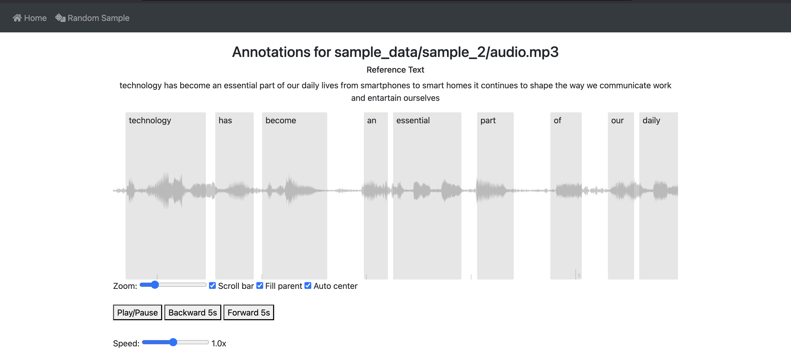

# Audio Annotation Visualizer
Simple flask server that uses wavesurfer.js to visualize and check for quality of annotations of your audio data. The interface looks like the image shown below. 

## Setup

1. **Clone the Repository**:
   Clone the repository to your local machine using the following command:
   ```bash
   git clone git@github.com:WadhwaniAI/audio-annotation-visualizer.git
   cd audio-annotation-visualizer
   ```

2. **Create and activate a Conda Environment**:
   Run the following command to create a conda environment named `visualizer` using Python 3.10:
   ```bash
   conda create -n visualizer python=3.10
   ```
   ```bash
   conda activate visualizer
   ```

3. **Install Dependencies**:
   Use the `requirements.txt` file to install all necessary dependencies:
   ```bash
   pip install -r requirements.txt
   ```

4. **Set Environment Variables**:
   Copy the `.env.example` file to `.env` and set the following environment variables:
   ```bash
   USERNAME=<username>
   PASSWORD=<password>
   AUDIO_ROOT_DIR=<path_to_audio_data>
   ```

5. **Run the Server**:
   ```bash
   python main.py
   ```

## Data Directory Setup
Set `audio_root_dir` in the `.env` file. The structure of the `audio_root_dir` should look like this:

- This is the path where all the audio data, corresponding reference text and annotation files are stored. Inside this directory:
- Each subdirectory represents a single data sample.
- Each subdirectory contains: 
   - `audio.mp3`: A recording of the sample.
   - `ref_text.txt`: (optional) A text file containing the reference text of the audio.mp3 recording. This is relevant for audios captured in a read aloud setting where the speaker is given a text to read.
   - `annotation.json`: A json file containing annotations corresponding to the `audio.mp3` recording.

Example structure:

```
audio_root_dir/
├── sample_1/
│   ├── audio.mp3
│   └── ref_text.txt
│   └── annotation.json
```

## Third-Party Library Notices

This project uses [wavesurfer.js](https://wavesurfer-js.org/), an open source audio waveform visualization library.

wavesurfer.js is licensed under the BSD-3-Clause License.

Copyright (c) 2012-2023, wavesurfer.js contributors.
All rights reserved.